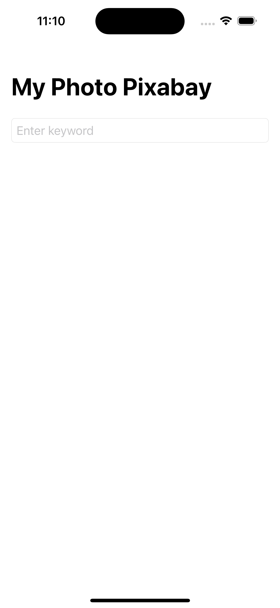
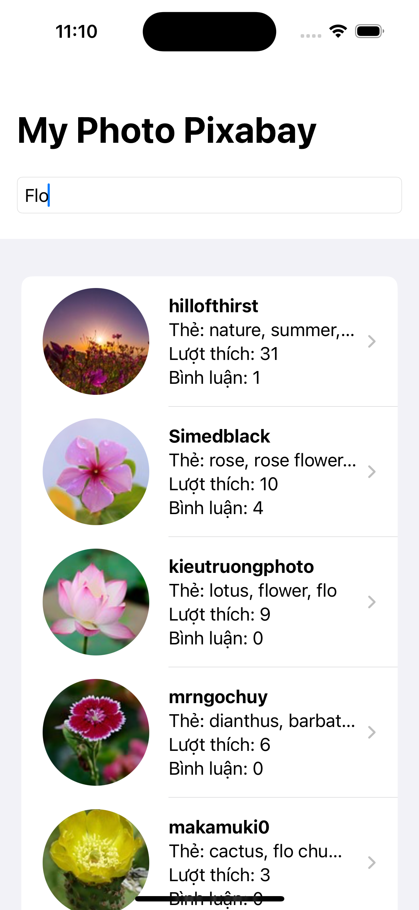

# SwiftUI Architectures: Clean Architecture, MVVM / MVI
This guide encompasses best practices and recommended architecture for building robust, high-quality apps
- [Guide to app architecture](https://developer.android.com/topic/architecture?continue=https%3A%2F%2Fdeveloper.android.com%2Fcourses%2Fpathways%2Fandroid-architecture%3Fhl%3Dvi%23article-https%3A%2F%2Fdeveloper.android.com%2Ftopic%2Farchitecture)

## 🚀 Introduction
### ⚡️ Dependencies
- [RxSwift](https://github.com/ReactiveX/RxSwift) : Rx is a generic abstraction of computation expressed through Observable<Element> interface, which lets you broadcast and subscribe to values and other events from an Observable stream
- [Alamofire](https://github.com/Alamofire/Alamofire) : Alamofire is an HTTP networking library written in Swift
- [Kingfisher](https://github.com/onevcat/Kingfisher) : Kingfisher is a powerful, pure-Swift library for downloading and caching images from the web. It provides you a chance to use a pure-Swift way to work with remote images in your next app.

## 🚀 Module Structure

There are 3 main modules to help separate the code. They are Data, Domain, and Presentaion.
- **Data** contains Local Storage, APIs, Data objects (Request/Response object, DB objects), and the
  repository implementation.
- **Domain** contains UseCases, Domain Objects/Models, and Repository Interfaces
- **Presentaion** contains UI, View Objects, Widgets, etc. Can be split into separate modules itself
  if needed. For example, we could have a module called Device handling things like camera,
  location, etc.

## 🚀 Screenshoots

|               Default Search               |          Search keyword (ex: flo)           |
|:------------------------------------------:|:-------------------------------------------:|
|                         |  |
